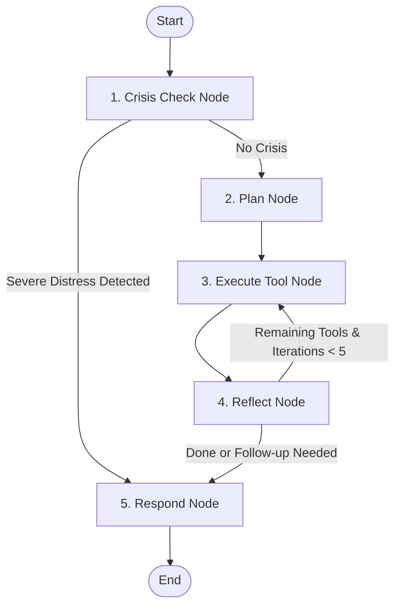

# InnerVoice — Comprehensive System Architecture & Feature Guide

This guide provides a detailed technical breakdown of **InnerVoice**, explaining how the system is structured, how each feature works behind the scenes, and how to discuss the project during an interview.

---

## 🏗️ 1. High-Level Architecture & Tech Stack

InnerVoice is built as a highly decoupled, stateful client-server application designed for robust performance, stateful persistence, and fast AI responses.

```
┌────────────────────────────────────────────────────────┐
│                   Next.js Frontend                     │
│  - App Router (React 18, TypeScript)                   │
│  - Styled with Glassmorphic Tailwind CSS               │
│  - State management via Zustand                       │
└──────────────────────────┬─────────────────────────────┘
                           │ Async REST API calls (Axios)
┌──────────────────────────▼─────────────────────────────┐
│                   FastAPI Backend                      │
│  - Async ASGI framework (Python 3.11+)                 │
│  - Database access: SQLAlchemy Async (aiosqlite)       │
│  - Background worker: APScheduler                      │
└──────────────────────────┬─────────────────────────────┘
                           │
┌──────────────────────────▼─────────────────────────────┐
│             LangGraph Agentic Orchestration            │
│  - Multi-Node State Graph workflow                    │
│  - Dynamic routing & execution loop                    │
└──────────────────────────┬─────────────────────────────┘
                           ├─────────────────────────────┐
             ┌─────────────┴─────────────┐ ┌─────────────┴─────────────┐
             │       SQLite DB           │ │         ChromaDB          │
             │   Relational Metadata     │ │   Vector Storage        │
             │   (Users, Chats, Reports) │ │   (Semantic Memory)       │
             └───────────────────────────┘ └───────────────────────────┘
```

### Tech Stack Breakdown
* **Frontend**: Next.js 14 (App Router), TypeScript, Tailwind CSS, Lucide Icons, Axios.
* **Backend**: FastAPI, LangGraph, SQLAlchemy (Async), aiosqlite, Pydantic, Uvicorn.
* **Databases**: SQLite (metadata and relation tracking) + ChromaDB (vector embeddings for semantic memory).
* **AI Orchestration**: Groq API powered by Llama 3.1 models.

---

## 🤖 2. The Agentic AI Reasoning Loop (LangGraph)

InnerVoice is not a basic single-prompt wrapper; it is an **agentic system** built using **LangGraph**. The execution flow runs through a dynamic `StateGraph` consisting of 5 main nodes.

> [!NOTE]
> For a detailed code walkthrough of how the global `AgentState` passes through nodes and how tools are invoked in the loop, see: **[AGENTIC_AI_DETAILS.md](file:///c:/Users/hp/Desktop/InnerVoice/AGENTIC_AI_DETAILS.md)**.



### Node-by-Node Explanation
1. **`crisis_node` (`CrisisCheckTool`)**:
   * Evaluates if the user's message indicates self-harm, medical emergency, or severe mental health crisis.
   * If a **severe crisis** is flagged, it directly overrides the plan, skips tool execution, and routes to `respond_node` to deliver immediate hotline support.
2. **`plan_node` (`PlanGeneratorTool`)**:
   * The orchestrator node. It inspects the conversation history, detected emotion, and memory context, then queries the LLM to output a JSON plan.
   * The plan specifies which tools (out of 12 available tools) are needed to handle this specific message.
3. **`execute_tool_node`**:
   * Processes the orchestrator's action plan by running one tool at a time (e.g. retrieving semantic memories, updating goals, or checking behavioral patterns).
   * Appends execution results to the shared `AgentState` dictionary.
4. **`reflect_node`**:
   * Inspects the current state.
   * If there are remaining tools in the plan and execution iterations are under 5, it loops back to `execute_tool_node`.
   * If a follow-up question is requested (because of vague user statements), it sets the `waiting_on_user` flag and routes to `respond_node`.
5. **`respond_node`**:
   * Compiles all gathered context (emotions, patterns, goals, memories, voice style).
   * Prompts the LLM with counseling-based guidelines to generate a warm, style-mirrored response, then saves the result to the SQLite database and adds the user message to ChromaDB.

---

## 📋 3. Core Features Deep Dive

### 🧠 A. Hybrid Long-term Semantic Memory
* **The Problem**: Normal LLM chats lose context after a few messages because of limited context windows.
* **The Solution**: When a user chats, the agent runs `MemorySaveTool` to extract important context (e.g., family relationships, fears, preferences, goals) and commits them to:
  1. **SQLite (`memories` table)**: Stored as structured items with categories (e.g. `relationship`, `fear`, `goal`) and reference counts.
  2. **ChromaDB Vector Store**: Converted into vector embeddings.
* **Retrieval**: When the user chats, the `MemoryRetrieveTool` runs a vector similarity search on ChromaDB. The retrieved semantic memories are injected directly into the response prompt, allowing the companion to recall facts from weeks or months ago.

### 🗂️ B. Monthly Reflection & Practitioner Insights (Dashboard)
* **The Concept**: Translates daily logs into high-value reflection reports. It offers a clean, tabbed interface separating the user's view from a clinician's view:
  * **Reflection Report (User)**: Personal emotional landscape summaries, mood journeys, key theme logs, self-care suggestions, and a language word cloud.
  * **Practitioner Insights (Doctor/Therapist)**:
    * *Practitioner Clinical Summary*: Objective summary of the user's emotional presentation.
    * *Mood Volatility Status*: Categorized as Low, Moderate, or High volatility based on statistical deviation in emotion scores.
    * *Cognitive Distortions Detection*: Identifies patterns like **Catastrophizing**, **All-or-Nothing Thinking**, or **Mind Reading** along with textual evidence extracted from the conversations.
    * *Stressors & Coping Grids*: Side-by-side lists outlining primary stressors and observed healthy or unhealthy coping mechanisms (e.g., mindfulness vs. avoidance).
* **Source Files**: [mirror_me_service.py](file:///c:/Users/hp/Desktop/InnerVoice/backend/services/mirror_me_service.py) & [page.tsx](file:///c:/Users/hp/Desktop/InnerVoice/frontend/app/mirror-me/page.tsx)

### ✍️ C. Dynamic Style-Mirroring Engine
* **How it works**: The `VoiceProfileTool` analyzes user messages for metrics like average sentence length, tone (e.g., casual vs. formal), punctuation preferences (ellipses, capitalization, exclamation marks), and vocabulary.
* **The Result**: The AI modifies its output formatting to match the user's style, making the conversation feel like they are reflecting inward or speaking with a close peer, which removes the typical "clinical AI bot" feel.

### 💬 D. WhatsApp-Style Chat UI
* **How it works**: Groups chat bubbles dynamically by day.
* **Features**:
  * centered date separators (e.g., `─── Today ───`, `─── Yesterday ───`, `─── Monday ───`) that update automatically.
  * Subtle right-aligned timestamps (e.g., `10:45 AM`) displayed neatly below bubbles.
* **Source File**: [page.tsx](file:///c:/Users/hp/Desktop/InnerVoice/frontend/app/chat/page.tsx)

### 🤝 E. Human-in-the-Loop (HITL) Turns
* **How it works**: If the user submits a vague, highly distressed, or context-lacking message (e.g., *"I'm so done with what they did today"*), the orchestrator triggers the `FollowupQuestionTool`.
* **The Flow**: The system pauses normal reflection, flags the message status as `waiting_for_user`, and prompts the user with a focused follow-up question. The agent resumes execution only once the user replies.

---

## 📈 4. Database Schema Overview

We use SQLite for structured data mapping. Key tables are:

```
┌─────────────────┐       ┌─────────────────┐       ┌─────────────────┐
│     users       │       │    messages     │       │ emotion_records │
├─────────────────┤       ├─────────────────┤       ├─────────────────┤
│ id (PK)         │◄─────┐│ id (PK)         │◄─────┐│ id (PK)         │
│ username        │       ││ user_id (FK)    │       ││ message_id (FK) │
│ password_hash   │       ││ user_message   │       ││ primary_emotion│
│ streak_count    │       ││ ai_response    │       ││ intensity      │
│ longest_streak  │       ││ created_at     │       ││ mood_score     │
└─────────────────┘       ││ followup_pend  │       └─────────────────┘
                          └─────────────────┘
```

* **`users`**: Manages auth credentials, login history, and streak metrics.
* **`messages`**: Contains chat history, AI reflections, agent plans, and follow-up pending status.
* **`emotion_records`**: Maps each message to primary/secondary emotions, intensity, and general mood score (1-10) for analytical tracking.
* **`memories`**: Stores extracted semantic memory statements, importance scores, categorization types, and active toggles.
* **`goals`**: Logs AI-extracted goals, completion status, action plans, and current targets.
* **`weekly_summaries`**: Stores summaries generated by APScheduler every 7 days.
* **`mirror_me_reports`**: Holds serialized monthly reports containing user insights and practitioner details.
