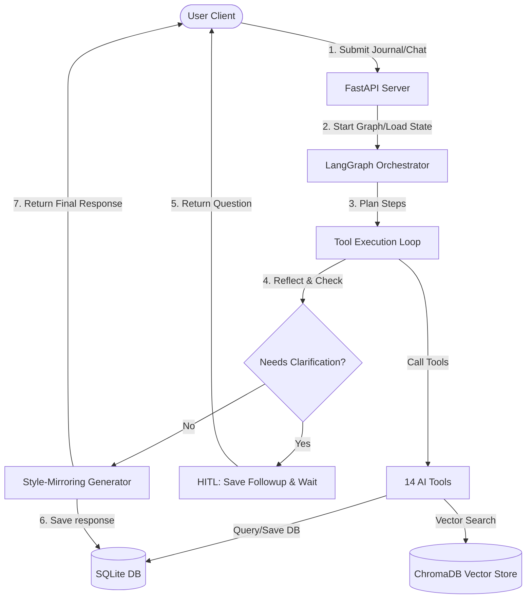

# InnerVoice — Developer & System Architecture Overview

InnerVoice is an autonomous reasoning system designed to serve as a private self-reflection companion. It leverages a LangGraph-powered reasoning loop that acts dynamically based on user input, tracks emotional trends, logs long-term memories, performs vector search for recall, and adapts its output style using a custom voice-mirroring engine.

This document serves as the comprehensive manual explaining the project’s structure, components, frontend navigation, backend API routes, and database models.

---

## 🏗️ Architecture & Tech Stack

### High-Level Architecture
InnerVoice is built as a split client-server application:
*   **Frontend**: Next.js (App Router, TypeScript) styled with Tailwind CSS in a responsive glassmorphic dark-theme design. State is managed via Zustand.
*   **Backend**: FastAPI (Python 3.11+) executing a dynamic LangGraph workflow. It stores metadata in SQLite (via SQLAlchemy and aiosqlite) and context vectors in ChromaDB.
*   **AI Orchestration**: Groq API powered by LLM models (`llama3-70b-8192` for orchestrating loops and generating final mirror-responses, and `llama3-8b-8192` for fast-executing tool calls).

---

## 📋 Core Features

1. **Autonomous Agentic Orchestration**
   * Powered by LangGraph, the agent plans a sequence of database searches, emotional checks, memory retrievals, and goal checks, then processes these tools dynamically.
2. **Voice Mirroring**
   * Analyzes user writing style metrics (sentence length, Hinglish ratio, tone, punctuation, vocabulary, use of caps/ellipses/exclamation marks) and writes reflections that mimic the user’s exact style.
3. **Human-In-The-Loop (HITL) Turns**
   * If the LLM identifies critical missing context in a journal entry (e.g. "I had a big argument with them today" without specifying who or why), it pauses and prompts the user with a follow-up question, resuming execution once answered.
4. **Mood & Emotional Analytics**
   * Logs primary/secondary emotions, intensity, and general mood score (1-10) for every entry, generating visual interactive analytics over time.
5. **Memory Retrieval & Storage**
   * Saves facts, relationships, goals, fears, preferences, and habits automatically to SQLite and builds semantic vector embeddings to query past memories in real-time.
6. **Goal Tracking**
   * Automatically extracts user goals, tracks their progress, proposes actions, and flags them as active/completed/paused.
7. **Background Scheduled Summarization**
   * Runs recurring background jobs (via APScheduler) to generate Weekly Summaries and monthly "Mirror Me" self-portrait reports.

---

## 🧭 Navigation Bar & Interface Routes

The application features a responsive sidebar Navigation Bar ([Navbar.tsx](file:///c:/Users/hp/Desktop/InnerVoice/frontend/components/shared/Navbar.tsx)) that routes users to the key interfaces. The sidebar also shows user status indicators, such as the current active reflection streak (in days) and total entry count.

### Navigation Items Mapping

| Navigation Link | Icon (Lucide) | Target Route | Core Purpose & Functionality |
| :--- | :--- | :--- | :--- |
| **Journal** | `BookOpen` | [`/journal`](file:///c:/Users/hp/Desktop/InnerVoice/frontend/app/journal) | Write new reflections, see historical entries list with color-coded emotion tags, and view individual entry details (including the agent's reasoning plan and tools used). |
| **Dashboard** | `LayoutDashboard` | [`/dashboard`](file:///c:/Users/hp/Desktop/InnerVoice/frontend/app/dashboard) | Main visual dashboard showing mood levels, emotion intensity charts, current streak tracking, and summaries of active goals and recent memories. |
| **Goals** | `Target` | [`/goals`](file:///c:/Users/hp/Desktop/InnerVoice/frontend/app/goals) | View, update, complete, or abandon goals. Display AI-suggested steps and timeline targets. |
| **Memories** | `Database` | [`/memories`](file:///c:/Users/hp/Desktop/InnerVoice/frontend/app/memories) | Browse the long-term memories categorized by type (goals, fears, preference, relationship, context, habit, hobby, achievement) with toggle buttons to disable/enable them. |
| **Mirror Me** | `Brain` | [`/mirror-me`](file:///c:/Users/hp/Desktop/InnerVoice/frontend/app/mirror-me) | View compiled Weekly Summaries and Monthly Self-Portrait reports describing the user's emotional arc, themes, and voice characteristics. |
| **Voice Profile** | `Mic2` | [`/voice-profile`](file:///c:/Users/hp/Desktop/InnerVoice/frontend/app/voice-profile) | Displays detailed metrics of the user's communication style: formality score, Hinglish mixing ratio, sentence length, and signature vocabulary. |
| **Chat** | `MessageSquare` | [`/chat`](file:///c:/Users/hp/Desktop/InnerVoice/frontend/app/chat) | Interactive channel to answer pending follow-up questions from the autonomous agent. |

---

## 🖥️ Page-by-Page Functional Flow

### 1. Auth Modules ([/auth/login](file:///c:/Users/hp/Desktop/InnerVoice/frontend/app/auth) & [/auth/register](file:///c:/Users/hp/Desktop/InnerVoice/frontend/app/auth))
*   **Behavior**: Handled via JWT tokens. Saves the login state inside the `authStore` (Zustand) and local storage.
*   **Routing Guard**: Checks for token existence. Unauthenticated users are redirected to login.

### 2. Journal Workspace ([/journal](file:///c:/Users/hp/Desktop/InnerVoice/frontend/app/journal))
*   **Creating Entries**: Provides a clean text-editor container. Once submitted, the app shows a dynamic "thinking" glassmorphic modal while the backend agent compiles.
*   **Follow-up Check**: If the backend determines a follow-up is needed, it redirects the user to the `/chat` route or opens the follow-up window.
*   **History Feed**: Renders entries sorted descending by date. Each entry lists a summary badge of the primary emotion detected (e.g. Joy 🟢, Anger 🔴, Sadness 🔵).
*   **Detail Panel**: Shows the detailed reflection response, plus debug tabs detailing:
    *   *Agent Plan*: Steps planned by the orchestrator.
    *   *Tools Used*: List of execution tools fired.

### 3. Dashboard Hub ([/dashboard](file:///c:/Users/hp/Desktop/InnerVoice/frontend/app/dashboard))
*   **Mood Tracker**: Line graph representing daily mood score fluctuations.
*   **Emotion Distribution**: Bar charts showing primary emotion frequencies.
*   **Widgets**: Fast-access containers showing active goal progress and recently added memory nodes.

### 4. Memories Manager ([/memories](file:///c:/Users/hp/Desktop/InnerVoice/frontend/app/memories))
*   **Interaction**: Allows users to manage the agent's long-term memory.
*   **Parameters**: Lists importance rating, classification category, and allows toggling `is_active` (which prevents the retrieval tool from injecting that memory in future prompts).

### 5. Goal Center ([/goals](file:///c:/Users/hp/Desktop/InnerVoice/frontend/app/goals))
*   **List View**: Organizes items into active, completed, paused, and abandoned.
*   **Management**: Users can manually write goals or approve goals auto-extracted by the AI.

### 6. Voice Profile Screen ([/voice-profile](file:///c:/Users/hp/Desktop/InnerVoice/frontend/app/voice-profile))
*   **Aesthetics**: Dial indicators and slider visualizations tracking formality, English vs Hinglish mix, emoji frequency, signature phrases, and exclamation percentages.

### 7. Chat Channel ([/chat](file:///c:/Users/hp/Desktop/InnerVoice/frontend/app/chat))
*   **HITL Execution**: Fetches pending conversations where the agent status is `waiting_for_user`. The user types responses to the follow-up prompt, which triggers the `/api/chat/reply` endpoint to resume the reasoning loop.

---

## 🗄️ Database Schema & Models

Data is persisted locally in SQLite. The models are declared in [`models.py`](file:///c:/Users/hp/Desktop/InnerVoice/backend/database/models.py).

### 1. `users`
Stores user profile information, authentication, and stats.
*   `id` (String, PK): Unique UUID.
*   `email` (String, Unique, Index): Registered email.
*   `username` (String)
*   `password_hash` (String)
*   `created_at` (DateTime): Registration timestamp.
*   `last_active` (DateTime): Last interaction.
*   `streak_count` (Integer): Daily streak.
*   `longest_streak` (Integer): Peak streak achieved.
*   `total_entries` (Integer): Count of entries logged.

### 2. `journal_entries`
Stores user reflections and agent execution metrics.
*   `id` (String, PK)
*   `user_id` (String, FK `users.id`)
*   `content` (Text): The raw text written by the user.
*   `word_count` (Integer)
*   `created_at` (DateTime)
*   `ai_response` (Text): Style-matched reply generated by the agent.
*   `agent_plan` (Text): JSON string detailing the orchestrator's step-by-step reasoning plan.
*   `tools_used` (Text): JSON list of tool names invoked.
*   `followup_question` (Text): Generated question if HITL triggers.
*   `followup_answered` (Boolean): Flag indicating if the user has responded.
*   `processing_status` (String): `pending`, `thinking`, `waiting_for_user`, `done`, `error`.

### 3. `emotion_records`
Stores deep emotion analysis scores.
*   `id` (String, PK)
*   `user_id` (String, Index)
*   `entry_id` (String, FK `journal_entries.id`)
*   `primary_emotion` (String): e.g., "joy", "fear", "sadness", "anger", "anxiety", "neutral".
*   `secondary_emotion` (String)
*   `intensity` (Float): Emotion score between 0.0 and 1.0.
*   `mood_score` (Float): Overall general mood scaling (1.0 to 10.0).
*   `confidence` (Float)
*   `raw_metadata` (Text): Extra breakdown JSON.
*   `created_at` (DateTime)

### 4. `memories`
Long-term semantic insights extracted from journal entries.
*   `id` (String, PK)
*   `user_id` (String, Index)
*   `memory_text` (Text): Extracted factual memory segment.
*   `memory_type` (String): e.g., `goal`, `hobby`, `relationship`, `fear`, `achievement`, `habit`, `preference`, `context`.
*   `importance_score` (Float)
*   `source_entry_id` (String)
*   `is_active` (Boolean): Controls retrieval injection.
*   `created_at` (DateTime)
*   `last_referenced` (DateTime)
*   `reference_count` (Integer)

### 5. `goals`
User goals dynamically tracked by the agent.
*   `id` (String, PK)
*   `user_id` (String, Index)
*   `title` (String)
*   `description` (Text)
*   `goal_type` (String): `career`, `health`, `habit`, `relationship`, `learning`, `personal`.
*   `status` (String): `active`, `completed`, `paused`, `abandoned`.
*   `progress_notes` (Text): JSON array of progress check-ins.
*   `created_at` (DateTime)
*   `target_date` (String)
*   `completed_at` (DateTime)
*   `source_entry_id` (String)
*   `ai_suggested` (Boolean)

### 6. `patterns`
Identified behavioral, temporal, or emotional cycles.
*   `id` (String, PK)
*   `user_id` (String, Index)
*   `pattern_description` (Text)
*   `pattern_type` (String): `emotional`, `behavioral`, `temporal`, `social`.
*   `confidence` (Float)
*   `first_detected` (DateTime)
*   `last_confirmed` (DateTime)
*   `occurrence_count` (Integer)

### 7. `followup_turns`
Maintains conversational turns for human-in-the-loop clarifications.
*   `id` (String, PK)
*   `user_id` (String)
*   `entry_id` (String, FK `journal_entries.id`)
*   `question` (Text): Clarification prompt.
*   `answer` (Text): User's reply.
*   `turn_number` (Integer): Incremental counter.
*   `created_at` (DateTime)
*   `answered_at` (DateTime)

### 8. `voice_profiles`
The style metrics used for text mirroring.
*   `id` (String, PK)
*   `user_id` (String, FK `users.id`, Unique)
*   `avg_sentence_length` (Float)
*   `avg_entry_length` (Float)
*   `formality_score` (Float)
*   `hinglish_ratio` (Float)
*   `uses_english_only` (Boolean)
*   `detected_languages` (String)
*   `uses_ellipsis` (Boolean)
*   `uses_caps_emphasis` (Boolean)
*   `uses_emoji` (Boolean)
*   `exclamation_ratio` (Float)
*   `question_ratio` (Float)
*   `dominant_tone` (String): `casual`, `formal`, `poetic`, `blunt`, `expressive`, `analytical`, `introspective`, `humorous`.
*   `vocabulary_richness` (Float)
*   `voice_sample_phrases` (Text): JSON array of sample phrases.
*   `signature_words` (Text): JSON array of recurring words.
*   `style_summary` (Text)
*   `response_style_instructions` (Text): Custom LLM prompting rules.
*   `entries_analyzed` (Integer)
*   `last_updated` (DateTime)
*   `raw_style_analysis` (Text): Detailed raw JSON.

---

## 🛠️ The 14 Autonomous Agent Tools

These functions are located in [`backend/agent/tools`](file:///c:/Users/hp/Desktop/InnerVoice/backend/agent/tools) and are managed by [`tool_registry.py`](file:///c:/Users/hp/Desktop/InnerVoice/backend/agent/tools/tool_registry.py).

1.  **`crisis_check`**: Screens input for signs of self-harm, medical urgency, or extreme safety violations. Overrides typical response to issue supportive safety hotlines.
2.  **`emotion_analyze`**: Runs LLM analysis on user entries to output primary emotion, secondary emotion, intensity, and general mood scale values.
3.  **`followup_question`**: Executed when critical gaps exist in the user’s story. Raises the `needs_followup` flag and formats a clarification question.
4.  **`goal_tracker`**: Scans entry for milestones or adjustments on goals. Updates progress history in the `goals` table.
5.  **`journal_search`**: Runs custom text queries on past database entries.
6.  **`memory_retrieve`**: Uses ChromaDB vector search to find and load semantic summaries of past entries relevant to current input.
7.  **`memory_save`**: Extracts persistent biographical details, relationship states, and preferences to log new records in the `memories` table.
8.  **`mood_analytics`**: Pulls historical mood lists to supply numerical values for visual frontend graphs.
9.  **`pattern_detect`**: Detects repeating themes, trigger responses, or cycles (e.g. "Stressed every Sunday evening").
10. **`plan_generator`**: Forms a step-by-step cognitive reasoning plan for the agent at the beginning of the execution thread.
11. **`reflection_generate`**: Renders the mirror reflection prompt based on current emotional analysis and active memories.
12. **`summary_generate`**: Formulates short structural digests of journal sessions.
13. **`voice_profile`**: Inspects text and updates the user's `voice_profiles` metrics.
14. **`weekly_summary`**: Ran asynchronously/via scheduler. Synthesizes weekly journal logs into a digestible summary report.
